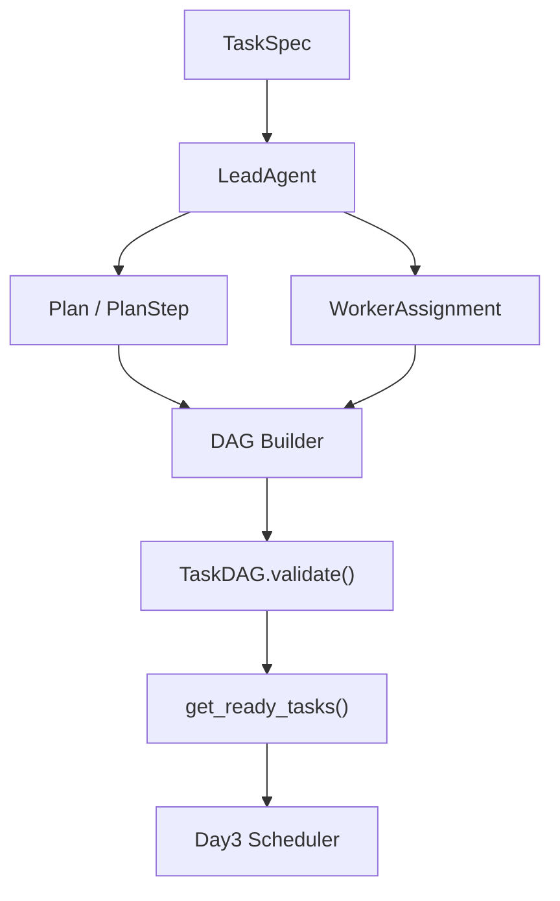
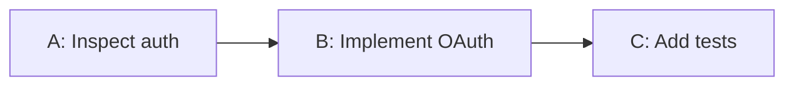
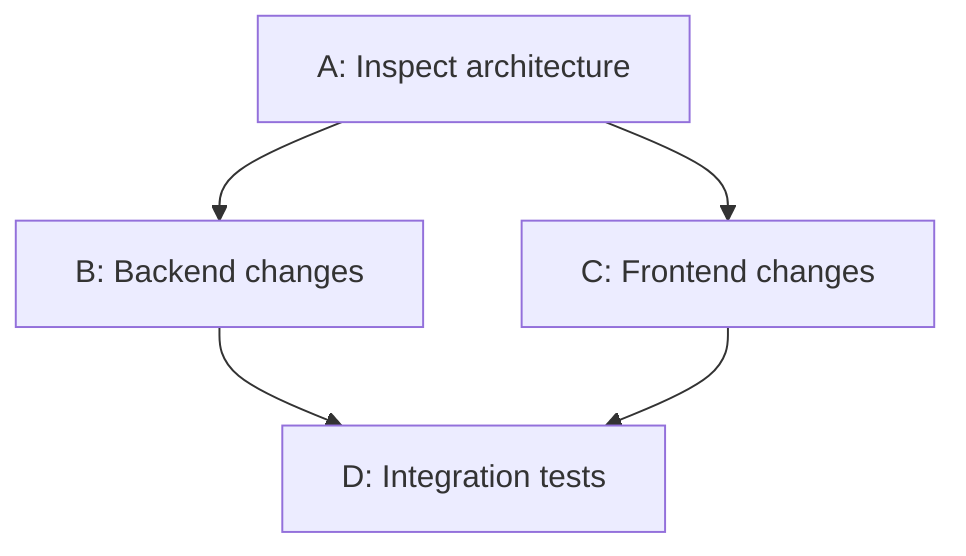
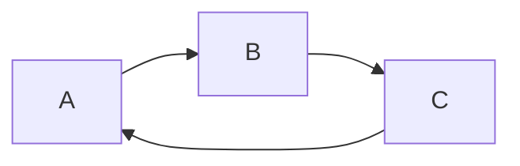

# Week5 Day 2：Task DAG 实现

今天是 Week5 Multi-Agent Runtime 的核心基础设施开发。

昨天学习了：

```text
Lead Agent
    |
    |
Task Planning
```

但是昨天生成的任务只是：

```json
{
 "tasks":[
    "实现后端接口",
    "修改前端页面",
    "补充测试"
 ]
}
```

它还不知道：

- 哪些任务可以并行？
- 哪些任务必须等待？
- 哪个任务失败会影响后续？
- Scheduler 下一步应该运行什么？


所以今天解决：

> **如何把 Agent 规划结果转换成可执行的任务依赖图，并让 Runtime 自动调度。**

这就是 Task DAG。

---

# 一、工业背景：为什么 Coding Agent 需要 DAG？

## 1. 真实软件任务不是线性的

例如用户：

> 给系统增加 OAuth 登录支持。


看似一个任务：

实际上：

```text
OAuth Feature

        |
        |
  ----------------

  |              |

数据库设计     前端页面

  |              |

  ------ API -----

          |

       测试验证
```

其中：

数据库：

↓

API

↓

测试


但是：

前端页面：

可以和数据库同时开发。


如果 Agent Runtime 不理解依赖：

只能：

```text
Database

↓

API

↓

Frontend

↓

Test
```

浪费时间。


---

# 二、DAG 基础知识

## 1. 什么是 DAG？

DAG：

Directed Acyclic Graph

有向无环图。


三个关键词：

---

## Directed（有方向）


例如：

```text
A → B
```

表示：

> B 依赖 A


不是：

```text
B → A
```


---

## Acyclic（无环）


允许：

```text
A → B → C
```

不允许：

```text
A → B → C → A
```


因为：

Scheduler 永远不知道谁先完成。

---

## Graph（图）


由：

Node

+

Edge


组成。

---

# 三、Task DAG 在 Agent Runtime 中是什么？

映射：

| DAG概念 | Agent概念 |
|-|-|
| Node | Task |
| Edge | Dependency |
| Graph | Task Plan |
| Traversal | Scheduling |
| Topological Sort | Execution Order |


例如：

```text
Task A:
分析认证代码


Task B:
实现 OAuth


Task C:
增加测试
```


依赖：

```text
A → B → C
```


表示：

```text
先分析

再实现

最后测试
```

---

# 四、工业界实践

## 1. LangGraph

LangGraph 的核心思想：

不是：

```text
LLM Chain
```


而是：

```text
State Graph
```


例如：

```text
        Planner

           |

       Research

           |

        Coding

           |

        Testing

           |

        Finish
```


每个节点：

就是一个 Agent Node。


边：

表示：

状态转移。


---

## 2. AutoGen

AutoGen GroupChat：

内部实际上也是：

```text
Conversation Graph
```


Manager 决定：

下一个 Agent。


例如：

```text
User

 ↓

Planner

 ↓

Coder

 ↓

Reviewer

 ↓

Coder Fix
```


---

## 3. GitHub Copilot Coding Agent

公开设计中：

复杂任务也会经历：

```text
Issue

↓

Planning

↓

Implementation

↓

Validation
```


本质：

也是一种执行图。

---

## 4. CI/CD Pipeline 类比

实际上 Agent DAG 很像：

GitHub Actions:

```yaml
build:

test:

deploy:
```

例如：

```text
build

 |

test

 |

deploy
```

deploy 必须等待 test。

Agent Runtime：

只是把：

Pipeline Node

换成：

Agent Task。


---

# 五、Task DAG 核心组件设计


今天实现：

```text
dag.py
```

包含：

```text
TaskNode

TaskDAG
```


---

# 六、TaskNode 设计


一个 Task Node 应包含：

```python
TaskNode
```

至少：

```python
id

description

role

status

dependencies

metadata
```


例如：

```python
TaskNode(
    id="backend_api",
    description="Implement OAuth API",
    role="backend"
)
```


---

状态：

```python
class TaskStatus(Enum):

    CREATED="created"

    READY="ready"

    RUNNING="running"

    COMPLETED="completed"

    FAILED="failed"
```


为什么 Task 有状态？


因为 Scheduler 需要知道：

哪些能执行。


---

# 七、TaskDAG 数据结构设计

推荐：

## nodes

保存任务：

```python
{
 "task1": TaskNode,
 "task2": TaskNode
}
```


---

## edges

保存依赖：


例如：

```text
A → B
```


保存：

```python
{
 "B":{
    "A"
 }
}
```


含义：

B 依赖 A。


---

最终：

```python
class TaskDAG:

    nodes: dict[str, TaskNode]

    dependencies:
        dict[str,set[str]]
```

---

# 八、核心接口设计

---

# 1. add_task()


作用：

添加任务。


例如：

```python
dag.add_task(
    TaskNode(
       id="T1",
       description="Analyze auth"
    )
)
```


结果：

```text
T1
```

---

# 2. add_dependency()


建立边。


例如：

```python
dag.add_dependency(
    "T1",
    "T2"
)
```


表示：

```text
T1 → T2
```


---

# 3. get_ready_tasks()


这是 Scheduler 最重要接口。


问题：

当前哪些 Task 可以执行？


规则：

一个任务：

满足：

```text
status == READY

AND

所有 dependency == COMPLETED
```


例如：

```text
A

↓

B

↓

C
```


当前：

A 完成。


返回：

```python
[
 B
]
```


---

# 4. validate()


检查 DAG 合法性。


包括：

## 依赖存在


错误：

```text
A → X
```

但是 X 不存在。


---

## 环检测


错误：

```text
A→B

B→A
```


必须拒绝。


---

# 九、Topological Sort（拓扑排序）

这是 DAG 最重要算法。

---

## 为什么需要？


Scheduler 需要知道：

执行顺序。


例如：

```text
A

↓

B

↓

C
```


排序：

```text
A,B,C
```


---

## Kahn Algorithm


工业实现常用。


核心：

维护：

入度。


例如：

```text
A → B

A → C

B → D

C → D
```


图：

```text
      A

    /   \

   B     C

    \   /

      D
```


入度：

```
A:0

B:1

C:1

D:2
```


步骤：

### Step1

找到：

入度0：

```text
A
```


执行。


---

### Step2

删除 A 出边：

```text
B,C
```


入度：

```text
B:0

C:0
```


---

### Step3


执行：

```text
B,C
```


---

### Step4

执行：

```text
D
```


---

# 十、Cycle Detection 环检测

为什么重要？


因为：

Agent Planner 可能生成错误 DAG。


例如：

```text
Task1:
等待 Task2


Task2:
等待 Task1
```


系统死锁。


---

实现方式：

DFS。


状态：

```python
WHITE
GRAY
BLACK
```


含义：

WHITE：

未访问。


GRAY：

正在访问。


BLACK：

完成。


---

如果 DFS：

发现：

GRAY 节点。


说明：

存在环。


---

# 十一、CodeTeam 中的位置


当前：

```text
LeadAgent

↓

TaskPlanner

↓

?????
```


今天补充：

```text
LeadAgent

↓

TaskPlanner

↓

TaskDAG

↓

TaskScheduler
```


未来：

```text
TaskDAG
   |
   |
Scheduler
   |
Worker Agents
```


---

# 十二、编码任务设计

目录：

```text
codeteam/

agent_team/

    dag.py
```


---

## TaskNode


```python
@dataclass
class TaskNode:

    id:str

    description:str

    role:str

    status:TaskStatus

    metadata:dict
```


---

## TaskDAG


```python
class TaskDAG:


    def add_task(
        self,
        task:TaskNode
    ):
        ...


    def add_dependency(
        self,
        src:str,
        dst:str
    ):
        ...


    def get_ready_tasks(self):
        ...


    def validate(self):
        ...
```


---

# 十三、测试设计


## Test 1：简单链路


构造：

```text
A→B
```


状态：

A:

COMPLETED


B:

READY


执行：

```python
get_ready_tasks()
```


结果：

```text
[B]
```


---

# Test 2：并行任务


结构：

```text
A

|

+---B

+---C
```


A 完成。


结果：

```text
[B,C]
```


表示：

可以并行。


---

# Test 3：循环依赖


输入：

```text
A→B

B→A
```


期待：

```python
validate()
```

失败。


---

# Test 4：Missing Dependency


输入：

```text
A→X
```


但是：

X不存在。


结果：

reject。


---

# 十四、Benchmark

今天重点：

验证 DAG Runtime 性能。


---

## 实验规模


生成：

```text
100 tasks

500 tasks

1000 tasks
```


---

## 指标1：

Build Time


定义：

```text
add_task
+
add_dependency
```

耗时。


---

## 指标2：

Resolve Latency


定义：

```text
get_ready_tasks()
```

耗时。


---

## 指标3：

Validation Time


定义：

```text
cycle detection
```

耗时。


---

结果：

例如：

| Tasks | Build | Resolve | Validate |
|-|-|-|-|
|100| | | |
|500| | | |
|1000| | | |


---

# 十五、Design Decision

## DD-W5-02

标题：

```
Why Task DAG Instead of Linear Execution Plan
```


---

## Problem


Coding Task 存在：

- 并行
- 依赖
- 动态变化


Linear Plan：

无法表达。


---

## Alternative


### A

List Plan


例如：

```text
Step1

Step2

Step3
```


问题：

无法并行。


---

### B

Task DAG


优势：

- dependency aware
- parallel execution
- failure recovery


---

## Decision


选择：

Task DAG。


原因：

符合真实软件工程流程。

---

# 十六、Failure Cases

建立：

```text
docs/failure_cases/week5/
```


---

## F-W5-D2-01

### Cycle DAG


现象：

Scheduler 永久等待。


原因：

Planner 生成错误依赖。


修复：

validate。


---

## F-W5-D2-02

### Missing Dependency


现象：

Task 找不到前置任务。


修复：

DAG validation。


---

## F-W5-D2-03

### Incorrect Dependency


例如：

错误：

```text
Test → Backend
```


实际：

应该：

```text
Backend → Test
```


导致：

提前测试。


---

# 十七、面试表达

面试：

> “为什么 Agent Team 需要 Task DAG？”


回答：

> 在复杂 Coding Task 中，任务之间存在明确依赖关系，并非简单线性执行。我设计 Task DAG 表示任务依赖，通过 Scheduler 根据 DAG 状态动态发现 Ready Task，实现并行执行。同时通过拓扑排序和环检测保证执行计划合法，避免 Agent 因错误规划进入死锁状态。


---

# 今日完成标准

代码：

```text
codeteam/

agent_team/

    dag.py
```


测试：

```text
tests/

agent_team/

    test_dag.py
```


必须支持：

✅ add_task  
✅ add_dependency  
✅ get_ready_tasks  
✅ validate  
✅ cycle detection  
✅ topological ordering  


文档：

```text
docs/design_decisions/DD-W5-02.md
docs/benchmark/W5_DAG_BENCHMARK.md
docs/failure_cases/W5_DAG_FAILURE.md
```


完成今天后，你的 CodeTeam 才真正具备：

> **Agent Team Runtime 的调度基础。**

昨天解决：

“谁负责做任务？”

今天解决：

“任务之间应该如何组织和运行？”

明天进入：

**Day3：Task Scheduler 与 Worker 并发执行。**

---

# Week5 Day2 实操教程：从结构化计划到可调度 Task DAG

> 本教程追加于原 Day2 计划之后。它只讲今天如何学习和实现，不在本轮创建 `codeteam/agent_team/dag.py` 或测试文件。

---

## 1. Today in the System

Week5 Day1 已经把 CodeTeam 从 Single-Agent Runtime 往团队控制平面推进了一步：

```text
TaskSpec
  -> LeadAgent
  -> Plan
  -> WorkerAssignment
```

但 Day1 的 `LeadPlanningResult` 仍然只是“每个 PlanStep 推荐给哪类 Worker”。它还没有表达：

```text
哪些 Assignment 可以先运行
哪些 Assignment 必须等待
哪些 Assignment 可以并行
某个前置任务失败后谁应该被阻塞
Day3 Scheduler 下一轮应该拿哪些节点
```

所以 Day2 的 `TaskDAG` 位于：

```text
LeadAgent / WorkerAssignment
  -> TaskDAG
  -> Day3 Scheduler
```

没有 DAG 时，Scheduler 只能看到一个 list。list 可以表达顺序，但不能可靠表达 fan-out、fan-in、断开的独立子图，也不能提前发现 cycle。对于 Multi-Agent Runtime，这会导致两个问题：

- 过度串行：本来可以同时给 BACKEND 和 FRONTEND Worker 的任务，被迫一个接一个做。
- 过早执行：测试任务可能在实现任务完成前被调度，产生假失败或浪费修复循环。

Day2 的目标不是“开始并发执行”，而是建立 Day3 可以信任的依赖图。

---

## 2. Capability Mapping

今天主要对应能力树：

```text
Multi-Agent Orchestration
├── Task DAG
├── Dependency Resolution
├── Scheduling input
└── Failure propagation boundary
```

它能证明的 Agent Runtime 工程能力：

- 能把模型/Lead 输出的结构化计划转成可验证的 Runtime 图。
- 能用明确不变量防止 cycle、unknown node、自依赖、重复节点等坏状态进入 Scheduler。
- 能区分“依赖已满足”这个计算事实和“任务状态 READY”这个运行时写入事实。
- 能为 Day3 并发调度提供无副作用的 ready resolution。
- 能用 benchmark 和 ablation 设计说明这个模块为什么不是普通 list 的语法包装。

面试时，这一层证明你理解 Multi-Agent 不是“开多个模型窗口”，而是需要一个能管理依赖、状态和可调度性的 Runtime。

---

## 3. 当前仓库真实状态

只读核实后的当前接口如下。

### Day1 已有模型，可复用

`codeteam/agent_team/models.py` 已有：

```python
AgentRole
AgentStatus
AgentIdentity
AgentInfo
WorkerAssignment
LeadPlanningResult
```

其中：

- `AgentRole` 表示 Worker 的职责类型，如 `BACKEND`、`FRONTEND`、`TEST`。
- `AgentStatus` 表示 Worker 自身生命周期状态，如 `READY`、`BUSY`。
- `WorkerAssignment` 表示一个 PlanStep 被分配给某类 Worker 的任务契约。
- `LeadPlanningResult` 持有现有 `Plan` 和完整 assignments。

`codeteam/agent_team/lead.py` 已有：

```python
LeadAgent
RoleAssigner
DeterministicRoleAssigner
```

`LeadAgent.create_plan()` 当前做两件事：

```text
Planner.create_plan(...)
  -> Plan
PlanStep
  -> WorkerAssignment
```

`codeteam/agent_team/worker.py` 已有：

```python
WorkerAgent
WorkerRegistry
DuplicateWorkerError
WorkerNotFoundError
```

Day2 不应该把 DAG 逻辑塞进 `WorkerRegistry`。Registry 只负责发现 Worker，不负责调度。

### 现有计划模型，可复用

`codeteam/planning/models.py` 已有：

```python
Plan
PlanStep
PlanStepStatus
```

`PlanStep` 是 Planner 产生的计划步骤。它包含：

```text
step_id
title
description
status
relevant_files
verification
```

它不是 Worker 运行时节点。不要直接在 `PlanStep` 上加 `dependencies`、`worker_id`、`ready_at`、`claimed_by`。

### Day2 还缺什么

当前尚无：

```text
codeteam/agent_team/dag.py
tests/agent_team/test_dag.py
```

Day2 需要新增：

```python
TaskStatus
TaskNode
TaskDAG
DAGError
DuplicateTaskNodeError
UnknownTaskNodeError
CycleDetectedError
InvalidDependencyError
```

命名可以按实际实现调整，但语义必须清楚。

### 四个状态不能混用

必须明确区分：

```text
PlanStepStatus
  Planner 步骤状态，属于 planning.models。

TaskStatus
  DAG 节点运行状态，属于 Day2 dag.py。

AgentStatus
  Worker 自身状态，属于 agent_team.models。

TaskStatus.READY
  不是 AgentStatus.READY，也不是 PlanStepStatus.PENDING。
```

推荐语义：

```text
PlanStep = Planner 产生的计划步骤
WorkerAssignment = 分配给某类 Worker 的任务契约
TaskNode = DAG 中可被 Scheduler 调度的运行时节点
```

一个 `TaskNode` 可以持有 `WorkerAssignment`，但不要把 `WorkerAssignment` 自己当状态机。

---

## 4. 核心契约与不变量

这是 Day2 最重要的部分。DAG 错一处，Day3 Scheduler 会把错误放大成并发错误。

### 4.1 边方向

建议接口：

```python
add_dependency(prerequisite_id, dependent_id)
```

方向定义：

```text
A -> B 表示 B 依赖 A
```

所以：

```python
add_dependency("A", "B")
```

意思是：

```text
先完成 A，B 才能 ready。
```

内部存储建议：

```python
dependencies["B"] = {"A"}
```

也就是：

```text
dependencies[dependent] = set(prerequisites)
```

这和自然语言一致：查 B 是否 ready，只需要看 `dependencies["B"]` 是否都完成。

### 4.2 “依赖已经满足”与 `TaskStatus.READY`

这两个概念必须分开：

- 依赖已经满足：由 `TaskDAG.get_ready_tasks()` 计算。
- `TaskStatus.READY`：由 Day3 Scheduler 或状态推进服务写入。

Day2 的 `get_ready_tasks()` 应该是无副作用查询：

```text
输入：当前 nodes 和 dependencies
输出：可调度 TaskNode 快照
不修改：任何 TaskNode.status
```

因此：

```python
ready = dag.get_ready_tasks()
```

不应该偷偷把节点从 `PENDING` 改成 `READY`。否则 Day3 Scheduler 很难区分“只是查了一下”和“正式把任务放入队列”。

### 4.3 节点和边的不变量

必须 fail fast：

- 重复节点：拒绝，不能覆盖旧节点。
- 重复边：幂等，重复添加同一条边不改变图。
- 自依赖：拒绝，例如 `A -> A`。
- 未知节点：拒绝，例如边里出现没有 `add_task()` 的节点。
- 环：`validate()` 或 `topological_sort()` 必须检测并拒绝。

重复边可以选择不报错，因为 `set` 天然去重。关键是要在测试中固定这个行为。

### 4.4 确定性顺序

这对测试、审计和 replay 很重要。

要求：

- ready task 顺序稳定。
- topological order 顺序稳定。
- 同一个 DAG 多次调用返回相同顺序。

实现策略：

```python
sorted(node_ids)
```

或者按插入顺序也可以，但必须测试并写进契约。Day2 推荐用排序，因为它不依赖未来持久化 Store 的读取顺序。

### 4.5 validate 与 topological_sort 无副作用

`validate()` 应该只检查：

```text
节点存在
边合法
无环
```

它不应该：

```text
修改节点状态
删除非法边
自动补节点
```

`topological_sort()` 也不应该修改原图。算法内部需要 indegree 或 queue 时，复制局部数据结构。

### 4.6 前置任务 FAILED 时后继任务怎么办

Day2 只提供判断材料，不做调度策略。

推荐 Day2 语义：

- `get_ready_tasks()` 只返回 `PENDING` 且所有前置节点 `COMPLETED` 的节点。
- 如果某个前置节点 `FAILED`，dependent 不会 ready。
- 是否把 dependent 标记为 `BLOCKED`、`SKIPPED`、`FAILED`，留给 Day3 Scheduler 或 Day5 lifecycle。

不要今天提前实现：

```text
failure propagation
retry routing
reassignment
manual unblock
```

---

## 5. Plan 到 DAG 的转换边界

Day2 的 DAG 输入应是 Day1 的：

```python
LeadPlanningResult
```

它包含：

```text
Plan
assignments
```

转换过程：

```text
LeadPlanningResult.assignments
  -> TaskNode
TaskNode
  -> TaskDAG.add_task(...)
dependency specs
  -> TaskDAG.add_dependency(...)
```

### 依赖关系从哪里来

当前真实代码中，`PlanStep` 没有 dependency 字段，`WorkerAssignment` 也没有 dependency 字段。所以 Day2 第一版不能假装依赖已经存在。

依赖来源可以有三种：

1. 外部显式输入：例如 `(("A-backend", "A-tests"), ("A-frontend", "A-tests"))`。
2. 明确独立：调用方传 `dependencies=()`，表示已经确认所有节点都可以作为 root。
3. 未声明依赖：调用方传 `dependencies=None` 或省略参数；多节点时必须 fail closed，不能默认并行。
3. 教学辅助转换：提供 `linear=True` 的 helper，把 Plan 顺序转换成链式依赖。

第一版建议：

```python
TaskDAG.from_lead_planning_result(
    result,
    dependencies=(("A-backend", "A-tests"), ("A-frontend", "A-tests")),
)
```

这里的 pair 仍然使用：

```text
(prerequisite_node_id, dependent_node_id)
```

当前 factory 的映射是：

```text
TaskNode.node_id = WorkerAssignment.assignment_id
```

也就是说，DAG 边引用的是运行时节点 ID。`source_step_id` 只是从 Planner 的 `PlanStep` 追踪到 `WorkerAssignment` 的审计字段，不是 DAG dependency 的 ID namespace。如果未来想让模型输出 `source_step_id` 依赖，需要写一个显式 adapter，把 step ID pair 转换成 assignment/node ID pair；不要让同一个参数同时接受两套 ID。

### 不要做的推断

不要因为 `Plan.steps` 是 tuple 就默认所有步骤线性依赖。tuple 只表示 Planner 输出顺序稳定，不表示依赖。

不要把 `relevant_files` 当可靠依赖。两个任务都提到 `src/auth.py` 可能意味着冲突，也可能只是都需要读同一个文件。文件重叠更适合 Day4 ownership 或 Day3 Scheduler 的 conflict gate，不是依赖本身。

不要提前实现 LLM DAG Planner。今天先让数据结构和不变量可测试；未来再让模型输出 dependency spec。

第一版局限：

- 无法自动从自然语言判断依赖。
- 无法表达条件分支。
- 无法表达 retry/replan 后的动态节点插入。
- 不做跨 Worker mailbox 通知。

这些留给 Week5 后续天。

---

## 6. Industrial Design

以下资料来自官方文档或官方产品页。注意区分官方事实、工程推断和 CodeTeam 本地选择。

### 6.1 LangGraph

官方事实：LangGraph 把 agent workflow 建模为 graph，核心包括 State、Nodes、Edges；nodes 执行工作，edges 决定下一步。`StateGraph` 需要 compile，compile 会做结构检查，也能配置 checkpointer 等运行时参数。普通边、条件边、入口边都是 routing 机制。官方还说明一个节点有多个 outgoing edges 时，下一 superstep 中多个目标节点可以并行执行。来源：[LangGraph Graph API overview](https://langchain-ai.github.io/langgraph/how-tos/state-reducers/)。

工程推断：LangGraph 更像“状态驱动的 workflow graph”。它允许循环和条件 routing，不等同于今天 CodeTeam 的 Task Dependency DAG。

CodeTeam 选择：Day2 只做 acyclic dependency graph，不做 StateGraph、conditional routing 或 loop，因为 Scheduler 的第一需求是找出 unblocked tasks，而不是执行通用 agent workflow。

### 6.2 AutoGen

官方事实：AutoGen 的 GroupChat / GroupChatManager 用于组织多个 agent 参与同一个 conversation，并由 manager 选择下一个 speaker。官方文档也有 GraphFlow/Directed Graph execution 的实验特性，支持顺序、fan-out、条件分支、join pattern，且节点可在所有父节点完成或任一父节点完成后激活。来源：[AutoGen GroupChat reference](https://microsoft.github.io/autogen/0.2/docs/reference/agentchat/groupchat/)、[AutoGen conversation patterns](https://microsoft.github.io/autogen/0.2/docs/tutorial/conversation-patterns/)、[AutoGen teams GraphFlow reference](https://microsoft.github.io/autogen/stable/reference/python/autogen_agentchat.teams.html)。

工程推断：AutoGen 的 group chat 重点是 conversation routing，GraphFlow 更接近 workflow activation graph。它们都证明“多 Agent 协作需要明确路由/激活规则”，但不能直接等同于 CodeTeam 的 `TaskNode` 依赖图。

CodeTeam 选择：Day2 不做对话 speaker selection。CodeTeam 的 DAG 节点代表可调度 assignment，不代表“下一个说话的 agent”。

### 6.3 Claude Code Agent Teams

官方事实：Claude Code Agent Teams 文档描述 team lead、teammates、shared task list 和 mailbox。teammates 有独立 context window；共享任务列表支持 task dependencies，pending task 在依赖未完成前不能被 claim；当依赖完成时 blocked tasks 会自动 unblock。文档也明确 Agent Teams 是 experimental，并存在 session resumption、task coordination、shutdown behavior 等限制。来源：[Claude Code Agent Teams docs](https://code.claude.com/docs/en/agent-teams)。

工程推断：Claude Code 的 shared task list 和 dependency unblock 说明 Coding Agent Team 需要一个可被多个 worker 查询和 claim 的任务依赖层。

CodeTeam 选择：Day2 先实现本地内存 `TaskDAG`，Day3 再实现 Scheduler claim，Day6 再考虑 durable store。

### 6.4 Codex / OpenAI

官方事实：OpenAI Codex 产品页描述 Codex 面向多 agent workflows，支持 worktrees 和 cloud environments，让 agents 可以在项目间并行工作。OpenAI Help Center 也描述 Codex app 可启用多个 Codex agents 并行，并有 built-in worktree support。来源：[OpenAI Codex product page](https://openai.com/codex/)、[Using Codex with your ChatGPT plan](https://help.openai.com/en/articles/11369540-using-codex-with-your-chatgpt-plan.pdf)。

工程推断：并行 coding agents 需要隔离 workspace、可审查 diff、调度和完成判定。公开资料没有说明内部是否使用 Task DAG，所以不能把 CodeTeam 的 DAG 描述成 Codex 内部实现。

CodeTeam 选择：本地实现 Task DAG，是为了给后续 Scheduler、Worktree ownership 和 Evaluation 提供明确接口。

### 6.5 四种设计比较

| 方案 | 优点 | 缺点 | Day2 选择 |
|---|---|---|---|
| 线性 list plan | 简单，和 `Plan.steps` 直接对应 | 不能表达并行、fan-in、断开子图；失败影响不清楚 | 只作为 baseline，不作为 Scheduler 输入 |
| 自研 adjacency map | 小、透明、易教学、易测试 | 需要自己实现 cycle detection 和 topo sort | Day2 默认 |
| `networkx` | 成熟，图算法丰富 | 新依赖过重；隐藏教学重点；序列化策略要额外设计 | 暂不引入 |
| 数据库持久化 DAG | 适合恢复、跨进程 claim、审计 | Day2 过早；会和 Day6 Session/Store 边界耦合 | Day6 再升级 |

Day2 第一版用自研 adjacency map，因为当前目标是掌握 Runtime 契约和不变量，而不是追求通用图计算库。

---

## 7. Architecture / Data Flow

完整数据流：

```text
TaskSpec
  -> LeadAgent.create_plan(task, repo_context)
  -> Plan + WorkerAssignment
  -> DAG Builder
  -> TaskDAG.validate()
  -> TaskDAG.get_ready_tasks()
  -> Day3 Scheduler
```

Mermaid 版本：



Chain：



含义：

```text
dependencies[B] = {A}
dependencies[C] = {B}
```

Fan-out / Fan-in：



含义：

```text
Backend 和 Frontend 可以并行。
Integration tests 必须等待两者完成。
```

Cycle：



含义：

```text
没有 root，没有合法拓扑序，validate 必须失败。
```

---

## 8. 分步骤学习与实现指南

### Step 1：定义 TaskStatus 与 TaskNode

目标：建立 DAG 节点的运行时状态语言。

原因：`PlanStepStatus` 是计划步骤状态，`AgentStatus` 是 Worker 状态，Day2 需要自己的节点状态。

涉及文件：

```text
codeteam/agent_team/dag.py
tests/agent_team/test_dag.py
```

Python 知识：

- `class TaskStatus(str, Enum)`。
- Pydantic `BaseModel`。
- 字段校验 `field_validator`。

接口骨架：

```python
class TaskStatus(str, Enum):
    PENDING = "pending"
    READY = "ready"
    RUNNING = "running"
    COMPLETED = "completed"
    FAILED = "failed"
    BLOCKED = "blocked"


class TaskNode(BaseModel):
    node_id: str
    assignment: WorkerAssignment
    status: TaskStatus = TaskStatus.PENDING
```

验证方式：

- 构造合法节点。
- 空 `node_id` 拒绝。
- 非法 status 拒绝。

常见错误：

- 复用 `AgentStatus.READY` 表示任务 ready。
- 把 `PlanStepStatus` 直接塞进 DAG。

完成标志：能解释 `TaskNode` 是 Scheduler 的运行时节点，不是 Planner 的 `PlanStep`。

### Step 2：定义 DAG 领域异常

目标：让坏图状态以明确异常失败。

原因：Scheduler 不应该收到含糊的 `KeyError` 或 `ValueError`。

接口骨架：

```python
class DAGError(Exception):
    pass

class DuplicateTaskNodeError(DAGError):
    pass

class UnknownTaskNodeError(DAGError):
    pass

class InvalidDependencyError(DAGError):
    pass

class CycleDetectedError(DAGError):
    pass
```

验证方式：

- 重复节点抛 `DuplicateTaskNodeError`。
- 未知依赖端点抛 `UnknownTaskNodeError`。
- 自依赖抛 `InvalidDependencyError`。
- 环抛 `CycleDetectedError`。

常见错误：只抛普通 `Exception`，导致测试和上层调度无法分类。

完成标志：每类坏输入都有领域异常。

### Step 3：设计 nodes / dependencies 存储

目标：确定图的内部结构。

推荐：

```python
class TaskDAG:
    def __init__(self) -> None:
        self._nodes: dict[str, TaskNode] = {}
        self._dependencies: dict[str, set[str]] = {}
```

含义：

```text
_nodes[node_id] = TaskNode
_dependencies[dependent_id] = {prerequisite_id, ...}
```

Python 知识：

- `dict[str, TaskNode]` 表示字符串到节点对象的映射。
- `set[str]` 表示去重的前置节点集合。
- 对外返回时不要直接暴露内部 set。

验证方式：

- 新图 nodes 为空。
- add_task 后 dependencies 初始化为空集合。

常见错误：

- 用 list 存 dependencies，导致重复边难处理。
- 对外返回内部 set，让调用方能绕过 API 修改图。

完成标志：能画出 `dependencies[B] = {A}`。

### Step 4：实现 add_task / add_dependency

目标：支持构图。

接口骨架：

```python
def add_task(self, node: TaskNode) -> None:
    ...

def add_dependency(self, prerequisite_id: str, dependent_id: str) -> None:
    ...
```

关键语义：

```text
add_dependency("A", "B") = A -> B = B 依赖 A
```

验证方式：

- 添加 chain。
- 重复节点拒绝。
- 未知端点拒绝。
- 自依赖拒绝。
- 重复边幂等。

常见错误：

- 把方向写反，导致 `get_ready_tasks()` 完全错。
- 允许边引用未知节点，后面 topo sort 才炸。

完成标志：可以构造 chain、diamond、断开的子图。

### Step 5：实现 validate

目标：检查图结构合法。

职责：

```text
所有 dependency endpoint 存在
无自依赖
无环
```

不做：

```text
修改状态
补节点
删除边
排序并保存
```

接口骨架：

```python
def validate(self) -> None:
    self.topological_sort()
```

如果 `topological_sort()` 已经能检测 cycle，`validate()` 可以复用它。

验证方式：

- 合法图 validate 不抛。
- cycle validate 抛 `CycleDetectedError`。
- validate 前后 `nodes` 和 `dependencies` 不变。

常见错误：validate 自动“修复”图，这会掩盖 Lead 或 DAG Builder 的 bug。

完成标志：validate 是无副作用 gate。

### Step 6：实现 Kahn topological sort

目标：得到确定性的合法执行顺序。

为什么用 Kahn：

- 容易解释。
- 能自然发现 cycle。
- 如果用普通队列，Kahn 算法可以做到 `O(V + E)`。
- 如果为了确定性顺序使用 `heapq` 按 `node_id` 取最小 ready 节点，复杂度应诚实记为 `O((V + E) log V)` 量级。

伪代码：

```text
计算每个节点 indegree
把 indegree=0 的节点放入 ready queue
每次取最小 node_id
删除它的 outgoing edges
新 indegree=0 的节点加入 queue
如果输出数量 < 节点数量，说明有环
```

注意：当前内部只有 prerequisites map。实现时可以临时构造 dependents map：

```python
dependents[prerequisite].add(dependent)
```

验证方式：

- chain 输出 A, B, C。
- diamond 输出满足 A 在 B/C 前，B/C 在 D 前。
- 断开子图输出稳定。
- 二节点环和长环都抛错。
- 多次调用结果相同。

常见错误：

- 直接修改 `_dependencies`。
- queue 使用 set 后输出顺序不稳定。

完成标志：拓扑结果满足所有边。

### Step 7：实现 get_ready_tasks

目标：返回当前可调度节点。

建议语义：

```python
def get_ready_tasks(self) -> tuple[TaskNode, ...]:
    ...
```

返回条件：

```text
node.status == TaskStatus.PENDING
and all(prereq.status == TaskStatus.COMPLETED for prereq in dependencies[node])
```

无依赖 PENDING 节点是 ready。

前置 FAILED 时，dependent 不 ready。是否标记 BLOCKED 留给 Day3。

验证方式：

- 初始并行 root 节点都 ready。
- A completed 后 B ready。
- A failed 后 B 不 ready。
- 全部 completed 后 ready 为空。
- 调用后节点 status 不变。

常见错误：

- get_ready_tasks 偷偷写 `TaskStatus.READY`。
- 把 RUNNING 节点也返回。

完成标志：Day3 Scheduler 可以安全轮询它。

### Step 8：公共 API 导出

目标：让后续代码可以稳定 import。

涉及文件：

```text
codeteam/agent_team/__init__.py
```

导出：

```python
TaskDAG
TaskNode
TaskStatus
DAGError
DuplicateTaskNodeError
UnknownTaskNodeError
InvalidDependencyError
CycleDetectedError
```

验证方式：

```python
from codeteam.agent_team import TaskDAG
```

常见错误：测试从内部路径 import，但公共 API 没导出，后续应用层难接。

完成标志：Day3 可以只依赖 `codeteam.agent_team`。

### Step 9：测试

目标：把不变量固定下来。

涉及文件：

```text
tests/agent_team/test_dag.py
```

覆盖见本文 Test Strategy。先测纯领域逻辑，不需要真实 Worker、Git、LLM 或 shell。

完成标志：

```bash
.venv/bin/python -m pytest tests/agent_team -q
```

### Step 10：DD、Benchmark、Ablation、Failure Cases

目标：记录设计假设，而不是伪造成果。

今天实现时可以先只补生产代码和测试。独立文档建议后续确认后创建：

```text
docs/design_decisions/DD-W5-02.md
```

本轮教程不创建这些文档。

完成标志：你能清楚说出 `DD-W5-02: DAG vs Linear Plan` 的选择、benchmark 指标和 ablation 对照。

---

## 9. Python 知识

### Enum

`Enum` 是固定词汇表。Day2 的 `TaskStatus` 应该用：

```python
class TaskStatus(str, Enum):
    PENDING = "pending"
```

好处是 Pydantic 能拒绝非法状态。不要用裸字符串到处比较。

### BaseModel / dataclass

`TaskNode` 需要校验外部或模型衍生数据，推荐 Pydantic `BaseModel`。

`TaskDAG` 是带行为的运行时对象，内部有 dict 和 set，推荐普通 class，不推荐 BaseModel。

### dict[str, set[str]]

```python
dependencies: dict[str, set[str]]
```

意思是：

```text
key: dependent node id
value: prerequisite node ids
```

例如：

```python
{"test": {"backend", "frontend"}}
```

表示 test 同时依赖 backend 和 frontend。

### default_factory

如果用 Pydantic 或 dataclass 存可变容器，不要写：

```python
items: set[str] = set()
```

因为可变默认值容易被共享。Pydantic 应使用：

```python
Field(default_factory=set)
```

但 Day2 的 `TaskDAG` 用普通 class，直接在 `__init__` 里：

```python
self._dependencies = {}
```

### 集合复制

不要把内部 set 直接返回：

```python
return self._dependencies
```

调用方可以绕开校验修改它。应该返回 tuple、frozenset，或复制后的 dict：

```python
return {
    node_id: frozenset(prereqs)
    for node_id, prereqs in self._dependencies.items()
}
```

### 异常

领域异常让测试和上层更清楚：

```python
raise CycleDetectedError("Task DAG contains a cycle")
```

比 `ValueError("bad")` 更适合 Runtime。

### 确定性排序

并行 ready 的节点可能有多个。为了 replay 和测试稳定，使用：

```python
for node_id in sorted(candidate_ids):
```

不要依赖 set 遍历顺序。

### DFS 与 Kahn

DFS cycle detection：

- 优点：写起来短。
- 缺点：对学习者不如 Kahn 直观看出 ready queue。

Kahn 算法：

- 先找 indegree=0 的节点。
- 不断移除 ready 节点。
- 最后没处理完说明有环。

复杂度：

```text
O((V + E) log V)
```

其中 V 是节点数，E 是依赖边数。

这个复杂度对应 Day2 的确定性 heap 版本：每个节点进入/离开 heap，边用于更新 indegree。代价比纯队列 Kahn 更高一点，但输出顺序稳定，适合测试、benchmark 和可复现调度。

---

## 10. Test Strategy

Day2 必测：

| 场景 | 断言 |
|---|---|
| chain | A before B before C |
| diamond | A before B/C, B/C before D |
| 并行根节点 | 初始 ready 返回多个 root，顺序稳定 |
| fan-in | D 等待 B 和 C 都完成 |
| 断开的子图 | 两组独立 chain 都能排序 |
| 部分完成 | A completed 后 B ready |
| 全部完成 | ready 为空 |
| 失败依赖 | A failed 时 B 不 ready |
| 重复节点 | 抛 DuplicateTaskNodeError |
| 未知端点 | 抛 UnknownTaskNodeError |
| 自依赖 | 抛 InvalidDependencyError |
| 二节点环 | validate/topo 抛 CycleDetectedError |
| 长环 | A->B->C->A 抛 CycleDetectedError |
| 稳定排序 | 多次 topo / ready 结果相同 |
| 拓扑结果满足所有边 | 对每条 A->B，A 的 index 小于 B |
| validate 无副作用 | validate 前后图快照相同 |
| topological_sort 无副作用 | topo 前后图快照相同 |
| get_ready_tasks 无副作用 | 查询前后 status 不变 |

并发执行不在 Day2 测。不要写“并发 Worker 同时执行”的测试来假装 Day2 已有 Scheduler。Day2 只测可调度集合是否正确。

建议命令：

```bash
.venv/bin/python -m pytest tests/agent_team/test_dag.py -q
.venv/bin/python -m pytest tests/agent_team -q
```

---

## 11. Benchmark / Ablation / DD / Failure Plan

### Benchmark Plan

Day2 benchmark 只测 DAG 数据结构，不测多 Agent 加速。

可复现图规模：

```text
100 nodes
500 nodes
1000 nodes
```

图形：

```text
chain
wide fan-out/fan-in
layered DAG
disconnected components
```

指标：

```text
build_ms
validate_ms
topological_sort_ms
get_ready_tasks_ms
node_count
edge_count
median
p95
python_version
commit_sha
```

运行方式：

```text
每组至少 30 次
丢弃 warmup
报告 median/p95
固定随机种子
```

不要把这个微基准写成“多 Agent 已经获得加速”。它只能说明 DAG 操作成本是否可接受。

### DD-W5-02

主题：

```text
Task DAG vs Linear Plan
```

核心论点：

- Linear Plan 简单，但不能表达并行和 fan-in。
- DAG 复杂一点，但能显式表达依赖和 ready resolution。
- Day2 选择自研 adjacency map，因为当前需要可教学、可测试、无额外依赖的 Runtime foundation。

Evidence 初始状态：

```text
PROPOSED
```

### Ablation Plan

A1：移除依赖图。

```text
Full: TaskDAG
Ablated: 按 Plan.steps 线性执行
指标: wall-clock potential, blocked task error, unnecessary serialization
```

A2：移除环检测。

```text
Full: validate/topological_sort detects cycle
Ablated: cycle 进入 Scheduler
指标: scheduler deadlock, no-ready-but-not-complete rate
```

A3：忽略 FAILED dependency。

```text
Full: failed prerequisite blocks dependent
Ablated: dependent 仍 ready
指标: premature execution count
```

### Failure Cases

F-W5-D2-01 Cycle：

```text
A -> B -> C -> A
```

预期：validate/topological_sort 抛 `CycleDetectedError`。

F-W5-D2-02 Missing Dependency：

```text
add_dependency("missing", "B")
```

预期：抛 `UnknownTaskNodeError`。

F-W5-D2-03 Incorrect Dependency：

```text
Test -> Backend
```

实际应是：

```text
Backend -> Test
```

预期：单元测试未必能自动发现语义错，benchmark/gold dependency dataset 要捕获它。

本轮不要创建独立 DD、Benchmark 或 Failure 文档。先把计划写清楚，等实现完成后再落盘。

---

## 12. Interview Focus 与完成标准

### 可背诵回答

> 我没有把 Lead 输出的计划直接交给多个 Worker 执行，因为 list plan 只能表达顺序，不能表达依赖、并行和 fan-in。Day2 我把 `LeadPlanningResult` 转成 `TaskDAG`，其中节点是可被 Scheduler 调度的 `TaskNode`，边 `A -> B` 表示 B 依赖 A。`get_ready_tasks()` 只做无副作用查询，返回所有前置任务已完成的 pending 节点；状态写入留给 Day3 Scheduler。`validate()` 和 topological sort 会 fail fast 检测未知节点、自依赖和 cycle。这样 Day3 并发调度时不是靠自然语言猜下一步，而是消费一个可验证、可测试、可 benchmark 的依赖图。

### 进入 Day2 Step1 前必须能回答

- `PlanStep`、`WorkerAssignment`、`TaskNode` 分别是什么？
- `add_dependency("A", "B")` 的方向是什么？
- 为什么 `dependencies["B"] = {"A"}`？
- 为什么 `get_ready_tasks()` 不应该修改状态？
- 为什么 `AgentStatus.READY` 不能表示任务 ready？
- cycle 为什么必须在 Scheduler 前发现？
- 为什么不能默认 `Plan.steps` 是线性依赖？
- 为什么 `relevant_files` 不是可靠 dependency？
- Kahn topological sort 如何发现环？
- Day2 哪些行为必须留给 Day3 Scheduler？

### 今日最终完成标准

教程阶段完成标准：

- 你能根据当前真实 Day1 接口解释 DAG 的输入和输出。
- 你能说清 edge 方向和内部 dependencies 存储。
- 你知道 ready resolution 与状态写入的边界。
- 你能列出 Day2 应实现的异常、不变量和测试地图。
- 你不会把 DAG 微基准包装成 Agent Team 加速结论。

实现阶段完成标准：

```text
codeteam/agent_team/dag.py 存在
tests/agent_team/test_dag.py 存在
TaskDAG 支持 add_task / add_dependency / validate / topological_sort / get_ready_tasks
cycle、unknown node、自依赖、重复节点都有测试
ready tasks 和 topo order 稳定
tests/agent_team 全绿
```
